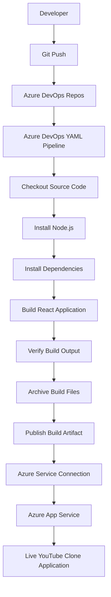
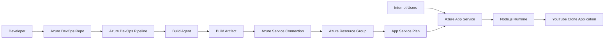
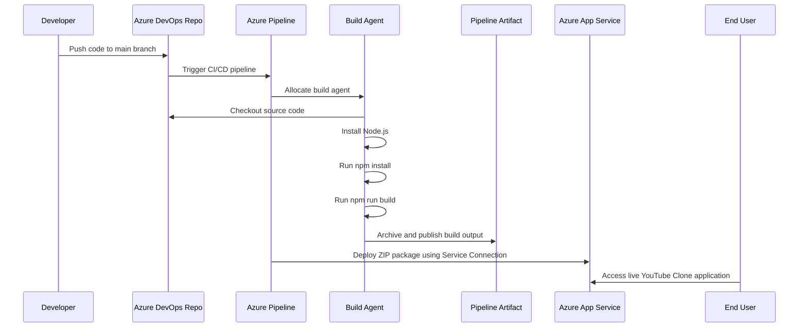
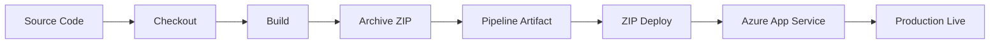

<div align="center">

# 🚀 Azure DevOps CI/CD Pipeline for YouTube Clone on Microsoft Azure

### Production-Ready CI/CD Architecture using Azure DevOps, Azure App Service, React.js and Node.js

[](https://azure.microsoft.com/products/devops)
[](https://azure.microsoft.com/)
[](https://react.dev/)
[](https://nodejs.org/)
[](https://yaml.org/)
[](LICENSE)

</div>

---

## 📌 Project Overview

This repository demonstrates a **production-style Azure DevOps CI/CD implementation** for building and deploying a **YouTube Clone application** on **Microsoft Azure App Service**.

The project uses **Azure DevOps Repos**, **Azure Pipelines**, **YAML-based automation**, **Azure Resource Manager Service Connection**, and **Azure App Service** to automate the complete software delivery lifecycle from source-code commit to live cloud deployment.

The goal of this project is to show how a React/Node.js application can be deployed using a reliable, repeatable, and scalable DevOps workflow.

---

## 🎯 Project Objectives

Build a YouTube Clone application using React.js and Node.js.
Store and manage source code in Azure DevOps Repos.
Create a YAML-based Azure DevOps CI/CD pipeline.
Automatically install dependencies and build the frontend application.
Package the production build as a deployment artifact.
Deploy the application to Azure App Service.
Follow production-oriented DevOps practices such as service connections, artifact handling, pipeline stages, and controlled deployment.

---

## 🧱 Technology Stack

| Layer | Technology |
|---|---|
| Cloud Platform | Microsoft Azure |
| Repository | Azure DevOps Repos |
| CI/CD | Azure DevOps Pipelines |
| Pipeline Format | YAML |
| Frontend | React.js |
| Backend | Node.js |
| Runtime | Node.js |
| Hosting | Azure App Service |
| Authentication to Azure | Azure Resource Manager Service Connection |
| Build Agent | Microsoft-hosted Ubuntu Agent / Self-hosted Agent |
| Version Control | Git |
| Package Manager | npm |

---

## 🏗️ Production High-Level Architecture



> Draw.io version: [`docs/architecture/azure-production-architecture.drawio`](docs/architecture/azure-production-architecture.drawio)

---

## ☁️ Azure Production Architecture



---

## 🔄 Complete CI/CD Workflow



---

## 📁 Repository Structure

```text
youtube-clone/
├── frontend/
│   ├── public/
│   │   └── index.html
│   ├── src/
│   │   ├── App.js
│   │   ├── App.css
│   │   └── index.js
│   ├── package.json
│   └── Dockerfile
├── backend/
│   ├── src/
│   │   └── App.js
│   ├── package.json
│   └── Dockerfile
├── Kubernetes/
│   └── backend-deployment.yaml
├── azure-pipelines-1.yml
├── README.md
└── .gitignore
```

---

## 📂 Directory Explanation

| Path | Purpose |
|---|---|
| `frontend/` | React.js frontend source code. |
| `frontend/public/` | Static public assets for the React application. |
| `frontend/src/` | React components, styling, routing, and application logic. |
| `frontend/package.json` | Frontend dependencies and npm build scripts. |
| `frontend/Dockerfile` | Optional container build file for frontend deployment. |
| `backend/` | Node.js backend source code. |
| `backend/src/` | Backend API/server logic. |
| `backend/package.json` | Backend dependencies and npm scripts. |
| `backend/Dockerfile` | Optional container build file for backend deployment. |
| `Kubernetes/` | Kubernetes deployment manifests for future AKS deployment. |
| `azure-pipelines.yml` | Azure DevOps CI/CD pipeline definition. |
| `docs/architecture/` | Draw.io architecture and workflow diagrams. |
| `.gitignore` | Files and folders excluded from Git tracking. |
| `README.md` | Complete project documentation. |

---

## ✅ Prerequisites

Before starting, ensure the following are available:

Microsoft Azure subscription
Azure DevOps organization
Azure DevOps project
Azure Repos enabled
Azure App Service created
Azure Resource Manager Service Connection configured
Node.js runtime configured on Azure App Service
Git installed locally
npm installed locally

---

## 🚀 Deployment Steps

## Step 1 — Create Azure Resource Group

Create a resource group to organize all Azure resources used by the project.

```bash
az group create \
  --name rg-youtube-clone-prod \
  --location centralindia
```

---

## Step 2 — Create Azure App Service Plan

Create an App Service Plan to host the web application.

```bash
az appservice plan create \
  --name asp-youtube-clone-prod \
  --resource-group rg-youtube-clone-prod \
  --sku B1 \
  --is-linux
```

---

## Step 3 — Create Azure Web App

Create the Azure Web App where the YouTube Clone will be deployed.

```bash
az webapp create \
  --name prashantyoutube \
  --resource-group rg-youtube-clone-prod \
  --plan asp-youtube-clone-prod \
  --runtime "NODE:18-lts"
```

---

## Step 4 — Configure Startup Command

For a React static build deployed to Azure App Service, configure the startup command.

```bash
az webapp config set \
  --name prashantyoutube \
  --resource-group rg-youtube-clone-prod \
  --startup-file "pm2 serve /home/site/wwwroot --no-daemon --spa"
```

---

## Step 5 — Create Azure DevOps Project

Create an Azure DevOps project and repository.

Recommended project setup:

| Setting | Value |
|---|---|
| Project Name | `youtube-clone-devops` |
| Visibility | Public or Private |
| Version Control | Git |
| Work Item Process | Agile |

---

## Step 6 — Push Source Code to Azure Repos

From the project root directory, run:

```bash
git init
git add .
git commit -m "Initial commit - YouTube Clone Azure DevOps CI/CD"
git branch -M main
git remote add origin <azure-repos-url>
git push -u origin main
```

---

## Step 7 — Create Azure Service Connection

In Azure DevOps:

```text
Project Settings
└── Service connections
    └── New service connection
        └── Azure Resource Manager
            └── Service principal / Workload identity federation
```

Recommended name:

```text
prashantservice
```

The pipeline uses this service connection to authenticate securely with Azure. No Azure credentials should be hardcoded in the YAML file.

---

## Step 8 — Create Azure Pipeline

Create a file named:

```text
azure-pipelines-1.yml
```

Add the following pipeline:

```yaml
trigger:
- main

pool:
  vmImage: 'ubuntu-latest'

variables:
  nodeVersion: '18.x'
  frontendWorkingDirectory: 'frontend'
  buildOutputPath: 'frontend/build'
  artifactName: 'frontend.zip'
  azureServiceConnection: 'prashantservice'
  azureWebAppName: 'prashantyoutube'

steps:
- task: NodeTool@0
  displayName: 'Use Node.js $(nodeVersion)'
  inputs:
    versionSpec: '$(nodeVersion)'

- task: Npm@1
  displayName: 'Install Frontend Dependencies'
  inputs:
    command: 'install'
    workingDir: '$(frontendWorkingDirectory)'

- task: Npm@1
  displayName: 'Build Frontend'
  inputs:
    command: 'custom'
    customCommand: 'run build'
    workingDir: '$(frontendWorkingDirectory)'

- script: |
    echo "Verifying React build output"
    ls -la $(buildOutputPath)
  displayName: 'Verify Build Output'

- task: ArchiveFiles@2
  displayName: 'Archive Frontend Build'
  inputs:
    rootFolderOrFile: '$(buildOutputPath)'
    includeRootFolder: false
    archiveType: 'zip'
    archiveFile: '$(Build.ArtifactStagingDirectory)/$(artifactName)'
    replaceExistingArchive: true

- publish: '$(Build.ArtifactStagingDirectory)/$(artifactName)'
  displayName: 'Publish Build Artifact'
  artifact: 'frontend-drop'

- task: AzureWebApp@1
  displayName: 'Deploy to Azure App Service'
  inputs:
    azureSubscription: '$(azureServiceConnection)'
    appType: 'webAppLinux'
    appName: '$(azureWebAppName)'
    package: '$(Build.ArtifactStagingDirectory)/$(artifactName)'
    startupCommand: 'pm2 serve /home/site/wwwroot --no-daemon --spa'
```

---

## Step 9 — Run the Pipeline

In Azure DevOps:

```text
Pipelines
└── New Pipeline
    └── Azure Repos Git
        └── Select Repository
            └── Existing Azure Pipelines YAML file
                └── /azure-pipelines.yml
```

Run the pipeline and verify each stage completes successfully.

---

## Step 10 — Verify Deployment

After successful deployment, open the Azure Web App URL:

```text
https://<app-name>.azurewebsites.net
```

Expected result:

```text
YouTube Clone application loads successfully from Azure App Service.
```

---

## 🧪 Pipeline Stage Details

| Stage | Description | Output |
|---|---|---|
| Initialize Job | Allocates build agent and loads pipeline metadata. | Agent ready |
| Checkout Source | Pulls latest source code from Azure Repos. | Code available on agent |
| Use Node.js | Installs/configures required Node.js version. | Node.js runtime ready |
| Install Dependencies | Runs `npm install` inside frontend folder. | `node_modules` installed |
| Build Frontend | Runs `npm run build`. | Production React build generated |
| Verify Build | Checks whether build output exists. | Build validation completed |
| Archive Build | Compresses build output into ZIP. | `frontend.zip` created |
| Publish Artifact | Stores package in Azure DevOps artifact storage. | Artifact available for deployment |
| Deploy Web App | Deploys ZIP to Azure App Service. | Application deployed |
| Production Live | Users access the application. | Live YouTube Clone |

---

## 📦 Artifact Flow



---

## 🔐 Production Security Best Practices

Use Azure Resource Manager Service Connection instead of hardcoded credentials.
Apply least-privilege RBAC permissions to the service connection.
Store secrets in Azure DevOps variable groups or Azure Key Vault.
Do not commit `.env`, credentials, tokens, or connection strings.
Protect the `main` branch using branch policies.
Require pull requests before production deployment.
Enable deployment approvals for production environments.
Enable App Service logs and monitoring.
Use HTTPS-only access on Azure App Service.

---

## 📈 Before vs After CI/CD Automation

| Before Automation | After Automation |
|---|---|
| Manual deployment | Automated CI/CD deployment |
| Manual file copy | ZIP deployment through pipeline |
| Higher human error risk | Consistent repeatable deployment |
| Slow release process | Faster release cycle |
| No standard workflow | YAML-based standardized workflow |
| Difficult rollback tracking | Artifact-based version tracking |

---

## 🧩 Azure Services Used

| Azure Service | Usage |
|---|---|
| Azure DevOps Repos | Source-code repository |
| Azure DevOps Pipelines | Build and deployment automation |
| Azure Service Connection | Secure authentication from pipeline to Azure |
| Azure App Service | Application hosting platform |
| Azure App Service Plan | Compute plan for Web App |
| Azure Resource Group | Logical grouping of Azure resources |
| Azure Monitor / Logs | Recommended production monitoring |
| Azure Key Vault | Recommended secret management |

---

## 🧰 Troubleshooting

| Issue | Possible Cause | Fix |
|---|---|---|
| Pipeline does not trigger | Branch trigger mismatch | Confirm code is pushed to `main` branch |
| `npm install` fails | Missing or invalid `package.json` | Check `frontend/package.json` |
| `npm run build` fails | Build script missing | Add `"build"` script in `package.json` |
| Build folder not found | React output path mismatch | Check whether output is `build` or `dist` |
| Azure deployment fails | Service connection permission issue | Verify service connection RBAC access |
| Web App shows blank page | SPA routing/startup issue | Use `pm2 serve /home/site/wwwroot --no-daemon --spa` |
| App does not load | Runtime mismatch | Verify Node.js version in App Service |

---

## 🚀 Future Enhancements

Add backend deployment pipeline.
Add multi-stage pipeline for Dev, Test, and Production.
Add approval gates before production deployment.
Add Docker image build and push to Azure Container Registry.
Deploy containerized application to Azure Kubernetes Service.
Add Terraform or Bicep for Infrastructure as Code.
Add SonarQube code-quality scanning.
Add OWASP dependency scanning.
Add Trivy container image scanning.
Integrate Azure Key Vault for secrets.
Enable Azure Monitor and Application Insights.
Implement Blue-Green or Canary deployment strategy.

---

## 📸 Project Deliverables

Azure DevOps Repository
Azure YAML Pipeline
Azure App Service deployment
Azure Service Connection
Build artifact generation
Automated production deployment workflow
React.js YouTube Clone frontend
Node.js backend structure
Draw.io architecture diagrams
GitHub-ready README documentation

---

## 👨‍💻 Author

**Prashant Mukadam**  
DevOps | Cloud Engineer | Azure | CI/CD | Automation | Azure DevOps

---

## ⭐ Support

If this project helped you understand Azure DevOps CI/CD deployment on Azure App Service, consider giving this repository a ⭐.

