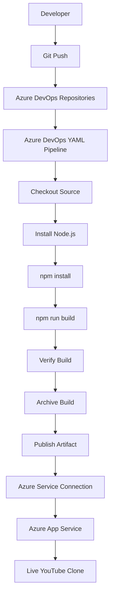

<div align="center">

# 🚀 Azure DevOps CI/CD Pipeline for YouTube Clone on Microsoft Azure

### Production-Ready DevOps Project using Azure DevOps, Azure App Service, React.js & Node.js

[](https://azure.microsoft.com/)
[](https://azure.microsoft.com/)
[](https://nodejs.org/)
[](https://react.dev/)
[]()
[]()

---

## 📖 Project Overview

This project demonstrates a **Production-Ready Continuous Integration and Continuous Deployment (CI/CD) pipeline** for deploying a **React.js + Node.js YouTube Clone** using **Azure DevOps** and **Microsoft Azure App Service**.

The entire software delivery lifecycle is automated using Azure Pipelines, enabling developers to build, test, package, publish, and deploy applications with minimal manual intervention.

This repository showcases industry-standard DevOps practices including:

✅ Azure DevOps Repositories
✅ YAML Pipelines
✅ Azure App Service Deployment
✅ Azure Resource Manager Service Connection
✅ Self-hosted Build Agent
✅ Continuous Integration
✅ Continuous Deployment
✅ Automated Artifact Management
✅ Production Deployment Workflow

---

# 🏗 Production High-Level Architecture



---

# ☁ Azure Production Architecture

```mermaid
flowchart LR

Dev[Developer]

Repo[Azure DevOps Repo]

Pipeline[Azure Pipeline]

Agent[Self Hosted Agent]

SC[Azure Service Connection]

RG[Resource Group]

Plan[App Service Plan]

WebApp[Azure Web App]

Internet[Users]

Dev --> Repo

Repo --> Pipeline

Pipeline --> Agent

Agent --> SC

SC --> RG

RG --> Plan

Plan --> WebApp

WebApp --> Internet

```



---

# 🔄 Complete CI/CD Workflow

```text
Developer
      │
Git Push
      │
      ▼
Azure DevOps Repository
      │
      ▼
Pipeline Trigger
      │
      ▼
Checkout Code
      │
      ▼
Install Node.js
      │
      ▼
Install Dependencies
      │
      ▼
Build React Application
      │
      ▼
Verify Build
      │
      ▼
Archive Files
      │
      ▼
Publish Pipeline Artifact
      │
      ▼
Azure Service Connection
      │
      ▼
Deploy to Azure App Service
      │
      ▼
Production Application Live
```

---

# 📁 Repository Structure

```
youtube-clone/
│
├── frontend/
│   ├── public/
│   ├── src/
│   ├── package.json
│   └── package-lock.json
│
├── backend/
│   ├── controllers/
│   ├── models/
│   ├── routes/
│   ├── server.js
│   └── package.json
│
├── azure-pipelines.yml
│
├── README.md
│
└── .gitignore
```

---

# ⚙ Technology Stack

| Category | Technology |
|------------|----------------|
| Cloud | Microsoft Azure |
| CI/CD | Azure DevOps |
| Repository | Azure Repos |
| Frontend | React.js |
| Backend | Node.js |
| Runtime | Node.js |
| Deployment | Azure App Service |
| Build Agent | Self-hosted Windows Agent |
| Version Control | Git |
| Pipeline | YAML |

---

# 🚀 Step 1 — Create Azure Resources

Create the following Azure resources:

- Azure Subscription
- Resource Group
- App Service Plan
- Azure Web App
- Configure Node.js Runtime
- Enable Web App

---

# 🚀 Step 2 — Create Azure DevOps Project

Create:

- Azure DevOps Organization
- Azure DevOps Project
- Azure Repository

Push source code

```
git init

git remote add origin <repository-url>

git add .

git commit -m "Initial Commit"

git push origin main
```

---

# 🚀 Step 3 — Configure Azure Service Connection

Create an Azure Resource Manager Service Connection.

Pipeline uses this secure connection to authenticate with Azure.

Benefits

- Secure Authentication
- No credentials inside YAML
- RBAC Enabled

---

# 🚀 Step 4 — Configure Self Hosted Agent

Install Azure DevOps Agent

Configure Agent Pool

Register Agent

Verify Agent Online

Benefits

- Faster Builds
- Reusable Environment
- Custom Software
- Better Performance

---

# 🚀 Step 5 — Create YAML Pipeline

Create

```
azure-pipelines.yml
```

Pipeline Trigger

```yaml
trigger:
- main

pool:
  vmImage: 'ubuntu-latest'

steps:

- task: NodeTool@0
  displayName: 'Use Node.js'
  inputs:
    versionSpec: '18.x'

- task: Npm@1
  displayName: 'Install Frontend Dependencies'
  inputs:
    command: 'install'
    workingDir: 'frontend'

- task: Npm@1
  displayName: 'Build Frontend'
  inputs:
    command: 'custom'
    customCommand: 'run build'
    workingDir: 'frontend'

- script: |
    echo "Checking build folder"
    ls -la frontend
    ls -la frontend/build
  displayName: 'Verify Build Output'

- task: ArchiveFiles@2
  displayName: 'Archive Build'
  inputs:
    rootFolderOrFile: 'frontend/build'
    includeRootFolder: false
    archiveType: 'zip'
    archiveFile: '$(Build.ArtifactStagingDirectory)/frontend.zip'
    replaceExistingArchive: true

- task: AzureWebApp@1
  displayName: 'Deploy Azure Web App'
  inputs:
    azureSubscription: 'prashantservice'
    appType: 'webAppLinux'
    appName: 'prashantyoutube'
    package: '$(Build.ArtifactStagingDirectory)/frontend.zip'
    startupCommand: 'pm2 serve /home/site/wwwroot --no-daemon --spa'
```

---

# 🔄 Azure Pipeline Workflow

```text
Initialize Pipeline
      │
Checkout Repository
      │
Install Node.js
      │
npm install
      │
npm run build
      │
Verify Build
      │
Archive Files
      │
Publish Artifact
      │
Deploy Azure Web App
      │
Application Live
```

---

# 📦 Pipeline Stages

## Stage 1

Initialize Build Environment

- Allocate Agent
- Download Tasks
- Load Variables

---

## Stage 2

Checkout Repository

```
Checkout Source Code
```

---

## Stage 3

Install Node.js

```
UseNode Task
```

---

## Stage 4

Install Dependencies

```bash
npm install
```

---

## Stage 5

Build Application

```bash
npm run build
```

Output

```
build/
```

---

## Stage 6

Verify Build

Validation

- Build Success
- Static Files Generated
- No Errors

---

## Stage 7

Archive Build

```
ArchiveFiles Task
```

Creates

```
application.zip
```

---

## Stage 8

Publish Artifact

Azure DevOps stores

- Build Output
- Deployment Package
- Version History

---

## Stage 9

Deploy Azure Web App

Azure DevOps uses

```
AzureWebApp Task
```

Deployment

```
ZIP Deploy
```

---

## Stage 10

Production Deployment

Application becomes available on Azure App Service.

Deployment completed successfully.

---

# 📂 Artifact Flow

```text
Source Code

↓

Checkout

↓

Build

↓

Archive

↓

Artifact

↓

Azure App Service

↓

Production
```

---

# ☁ Azure Services Used

- Azure DevOps
- Azure Repositories
- Azure Pipelines
- Azure Resource Manager
- Azure App Service
- Azure Service Connection
- Self-hosted Agent
- Git
- Node.js

---

# 🔒 Security Best Practices

- Azure Resource Manager Service Connection
- RBAC Access Control
- Secure Pipeline Variables
- No Hardcoded Credentials
- Version Controlled YAML
- Automated Deployments

---

# 📈 CI/CD Benefits

Before Automation

- Manual Deployment
- Manual File Copy
- Human Errors
- Slow Releases
- No Version Tracking

After Automation

- Automated CI/CD
- One-click Deployment
- Faster Releases
- Consistent Builds
- Reliable Deployment
- Centralized Pipeline
- Easy Rollback
- Artifact Versioning

---

# 🎯 Skills Demonstrated

- Azure DevOps
- Azure Pipelines
- YAML
- Azure App Service
- Azure Resource Manager
- Azure Service Connections
- Azure Repositories
- Self-hosted Agent
- Git
- React.js
- Node.js
- CI/CD
- Build Automation
- Deployment Automation
- Production Release Management
- DevOps Best Practices

---

# 📸 Project Deliverables

- Azure DevOps Repository
- Azure YAML Pipeline
- Azure App Service Deployment
- Azure Service Connection
- Self-hosted Agent Configuration
- Production CI/CD Pipeline
- Automated Deployment Workflow
- React.js Frontend
- Node.js Backend

---

# 🚀 Future Enhancements

- Docker Containerization
- Azure Container Registry
- Azure Kubernetes Service (AKS)
- Terraform Infrastructure as Code
- SonarQube Code Analysis
- OWASP Dependency Check
- Trivy Security Scanning
- Azure Key Vault
- Azure Monitor
- Application Insights
- Multi-stage Release Pipeline
- Blue-Green Deployment
- Canary Deployment

---

# 🤝 Contributing

Contributions are welcome!

1. Fork the repository
2. Create a feature branch
3. Commit your changes
4. Push your branch
5. Open a Pull Request

---

# ⭐ Support

If you found this project useful, please consider giving it a ⭐ on GitHub.

It helps others discover the project and motivates future improvements.

---

# 👨‍💻 Author

**Prashant Mukadam**

DevOps | Cloud Engineer | Azure | CI/CD | Automation
